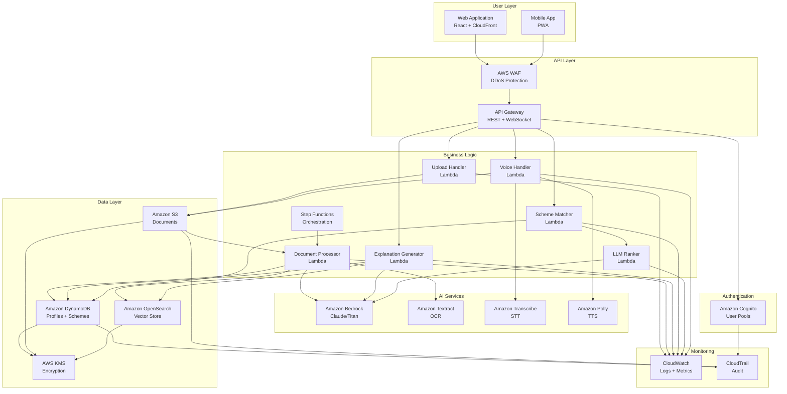
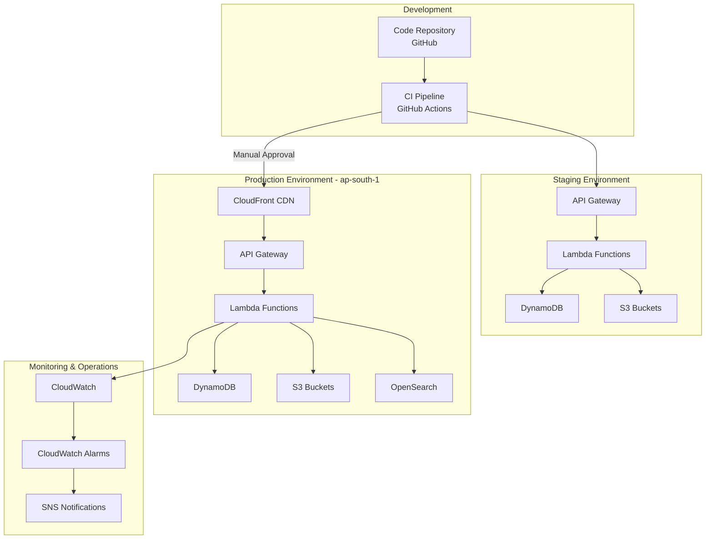

# Design Document: Soochna Setu AI

## Overview

Soochna Setu AI is a serverless, AI-powered civic intelligence platform built entirely on AWS services. The system transforms complex government documents, policies, and schemes into accessible, personalized information for citizens across literacy and language barriers.

The architecture follows a microservices pattern using AWS Lambda functions orchestrated through API Gateway, with Amazon Bedrock providing LLM capabilities, Amazon Textract handling document processing, and Amazon OpenSearch enabling semantic search through vector embeddings. The platform implements a hybrid rule-based and AI-driven approach for scheme recommendations, ensuring both accuracy and explainability.

Key design principles:
- **Serverless-first**: All compute uses Lambda for automatic scaling and cost optimization
- **AI-native**: Bedrock LLMs power all natural language understanding and generation
- **Citation-driven**: Every AI output includes traceable source references
- **Accessibility-first**: Multi-language and voice interfaces as core features, not add-ons
- **Privacy-by-design**: Encryption, minimal data collection, and user control over personal data
- **Performance-optimized**: Caching, async processing, and progressive loading for low-bandwidth scenarios

The system serves four primary user personas: rural farmers with low digital literacy, urban students seeking education schemes, senior citizens needing healthcare benefits, and policy researchers analyzing government data. Each persona's needs inform specific design decisions around interface simplicity, language support, and information depth.

## Architecture

### High-Level System Architecture

The CivicLens AI platform consists of six primary layers:

**1. Presentation Layer**
- Web application (React/Next.js) hosted on S3 + CloudFront
- Mobile-responsive design with progressive web app (PWA) capabilities
- Voice interface components integrated into UI
- Multi-language UI with dynamic content switching

**2. API Layer**
- Amazon API Gateway (REST APIs) with request/response transformation
- AWS WAF for DDoS protection and rate limiting
- API Gateway caching for frequently accessed scheme data
- Request validation and authentication token verification

**3. Authentication & Authorization Layer**
- Amazon Cognito User Pools for user management
- JWT token-based authentication
- IAM roles for service-to-service authorization
- Fine-grained access control for user data

**4. Business Logic Layer**
- AWS Lambda functions for all backend processing
- Step Functions for orchestrating multi-step workflows
- EventBridge for event-driven architecture
- Lambda layers for shared code and dependencies

**5. AI & Processing Layer**
- Amazon Bedrock (Claude/Titan models) for LLM inference
- Amazon Textract for document OCR and table extraction
- Amazon Transcribe for speech-to-text conversion
- Amazon Polly for text-to-speech synthesis
- Amazon OpenSearch for vector storage and semantic search

**6. Data Layer**
- Amazon S3 for document storage with lifecycle policies
- Amazon DynamoDB for user profiles and scheme metadata
- Amazon OpenSearch for document embeddings
- AWS KMS for encryption key management
- CloudWatch Logs for audit trails

### Detailed AWS Architecture

#### Document Processing Flow

```
User Upload → API Gateway → Lambda (Upload Handler)
                              ↓
                         S3 Bucket (Raw Documents)
                              ↓
                    S3 Event Notification
                              ↓
                  Lambda (Document Processor)
                              ↓
                    Amazon Textract API
                              ↓
              Lambda (Text Chunking & Embedding)
                              ↓
                    Amazon Bedrock (Embeddings)
                              ↓
              Amazon OpenSearch (Vector Store)
                              ↓
              DynamoDB (Document Metadata)
```

**Flow Details:**

1. **Upload Handler Lambda**: Validates file type/size, generates presigned S3 URL, returns upload endpoint
2. **S3 Storage**: Documents stored with user-id prefix, versioning enabled, lifecycle policy archives after 90 days
3. **Document Processor Lambda**: Triggered by S3 event, calls Textract for OCR, handles tables separately
4. **Textract Processing**: Extracts text blocks, tables, and forms; returns structured JSON with confidence scores
5. **Chunking Strategy**: Splits text into 512-token chunks with 50-token overlap for context preservation
6. **Embedding Generation**: Uses Bedrock Titan Embeddings model to create 1536-dimensional vectors
7. **OpenSearch Indexing**: Stores vectors with metadata (page number, document ID, chunk position)
8. **Metadata Storage**: DynamoDB stores document name, upload date, processing status, user ID

**Error Handling:**
- Textract failures trigger retry with exponential backoff (3 attempts)
- Malformed documents stored in quarantine S3 bucket for manual review
- Processing status tracked in DynamoDB with timestamps for monitoring

#### Scheme Suggestion Flow

```
User Profile Input → API Gateway → Lambda (Profile Validator)
                                        ↓
                                DynamoDB (User Profiles)
                                        ↓
                          Lambda (Scheme Matcher)
                                        ↓
                    DynamoDB (Scheme Database) ← Rule-based filtering
                                        ↓
                          Selected Schemes (5-10)
                                        ↓
                          Lambda (LLM Ranker)
                                        ↓
                          Amazon Bedrock (Claude)
                                        ↓
                    Ranked Schemes + Reasoning
                                        ↓
                          API Gateway → User
```

**Flow Details:**

1. **Profile Validator Lambda**: Validates required fields (age, income, state, category), normalizes data formats
2. **User Profile Storage**: DynamoDB table with user-id as partition key, encrypted sensitive fields
3. **Scheme Matcher Lambda**: Implements rule-based filtering using DynamoDB queries and filter expressions
4. **Rule-Based Filtering**: 
   - Age range matching (e.g., scheme requires 18-35, user is 25)
   - Income bracket matching (e.g., scheme for BPL, user income < threshold)
   - State/region matching (e.g., scheme available in Maharashtra, user from Mumbai)
   - Category matching (e.g., scheme for SC/ST, user category matches)
   - Disability status matching (e.g., scheme for persons with disabilities)
5. **LLM Ranker Lambda**: Sends filtered schemes + user profile to Bedrock for intelligent ranking
6. **Bedrock Prompt**: "Given user profile {profile}, rank these schemes {schemes} by eligibility likelihood. Provide reasoning for each."
7. **Response Parsing**: Extracts eligibility scores (0-100), reasoning text, and document requirements
8. **Caching**: Frequently requested scheme combinations cached in API Gateway for 5 minutes

**Hybrid Approach Rationale:**
- Rule-based filtering ensures 100% accuracy for hard constraints (age, location)
- LLM ranking handles nuanced eligibility (e.g., "preference for first-time applicants")
- Reduces LLM token usage by pre-filtering from 1000+ schemes to 5-10 candidates
- Provides explainable results through both rule matches and LLM reasoning

#### Public Data Explanation Flow

```
User Query + Document ID → API Gateway → Lambda (Query Handler)
                                              ↓
                                  Amazon OpenSearch (Vector Search)
                                              ↓
                                  Top 5 Relevant Chunks
                                              ↓
                                  Lambda (RAG Orchestrator)
                                              ↓
                                  Amazon Bedrock (Claude)
                                              ↓
                              Generated Explanation + Citations
                                              ↓
                              Lambda (Citation Validator)
                                              ↓
                              API Gateway → User
```

**Flow Details:**

1. **Query Handler Lambda**: Converts user question to embedding using Bedrock
2. **Vector Search**: OpenSearch k-NN search finds top 5 most semantically similar chunks
3. **RAG Orchestrator Lambda**: Constructs prompt with retrieved context and user query
4. **Bedrock Prompt Template**:
   ```
   Context: {retrieved_chunks}
   User Question: {query}
   Instructions: Explain in Grade 5 language. Cite sources with [Doc: {name}, Page: {num}].
   ```
5. **Citation Validator Lambda**: Verifies all citations reference actual retrieved chunks, flags hallucinations
6. **Response Formatting**: Structures output with summary, key points, citations, and "What this means for you" section

**Retrieval-Augmented Generation (RAG) Benefits:**
- Grounds LLM responses in actual document content
- Reduces hallucination by providing source context
- Enables citation tracking for transparency
- Allows updating knowledge base without retraining models

#### Voice Interaction Flow

```
Voice Input → API Gateway → Lambda (Audio Handler)
                                  ↓
                          S3 (Temporary Audio Storage)
                                  ↓
                          Amazon Transcribe
                                  ↓
                          Text Transcript
                                  ↓
                  Lambda (Intent Router) → [Document/Scheme/Profile Flow]
                                  ↓
                          Text Response
                                  ↓
                          Lambda (TTS Handler)
                                  ↓
                          Amazon Polly
                                  ↓
                          Audio Response (MP3)
                                  ↓
                          S3 (Cached Audio) → CloudFront → User
```

**Flow Details:**

1. **Audio Handler Lambda**: Receives base64-encoded audio, validates format (MP3/WAV), stores in S3
2. **Transcribe Job**: Asynchronous job for audio > 10 seconds, synchronous for shorter clips
3. **Language Detection**: Transcribe auto-detects language from supported set (English, Hindi, Tamil, etc.)
4. **Intent Router Lambda**: Analyzes transcript to determine user intent (explain document, find scheme, update profile)
5. **Processing**: Routes to appropriate backend flow based on intent
6. **TTS Handler Lambda**: Converts text response to speech using Polly with appropriate voice for language
7. **Audio Caching**: Frequently requested responses cached in S3 with CloudFront CDN for fast delivery
8. **Streaming**: For long responses, implements streaming audio delivery to reduce perceived latency

**Voice Optimization:**
- Polly Neural voices for natural-sounding speech
- SSML markup for controlling pace, pauses, and emphasis
- Audio compression (MP3 64kbps) for bandwidth efficiency
- Progressive audio loading for slow connections

## Components and Interfaces

### Frontend Components

**1. Document Upload Component**
- Interface: File input with drag-and-drop, progress bar, format validation
- Supported formats: PDF, PNG, JPG, JPEG (max 50MB)
- Client-side validation before upload
- Presigned URL upload to S3 for security
- Real-time processing status updates via WebSocket (API Gateway WebSocket API)

**2. Explanation Viewer Component**
- Interface: Displays AI-generated summaries with collapsible sections
- Citation links that highlight source paragraphs
- "Simplify more" button for additional clarification
- Export to PDF/text functionality
- Share via WhatsApp/email integration

**3. Scheme Browser Component**
- Interface: Search bar, category filters, state selector
- Card-based layout showing scheme name, eligibility summary, deadline
- Sorting by relevance, deadline, or popularity
- Bookmark/save functionality for later review

**4. Profile Management Component**
- Interface: Multi-step form with progress indicator
- Field validation with helpful error messages
- Optional fields clearly marked
- Privacy controls for data sharing preferences
- Profile completeness indicator

**5. Voice Interface Component**
- Interface: Microphone button with visual feedback (waveform animation)
- Push-to-talk and continuous listening modes
- Real-time transcription display
- Audio playback controls (pause, replay, speed adjustment)
- Fallback to text input if voice fails

**6. Language Selector Component**
- Interface: Dropdown or flag icons for language selection
- Persists selection across sessions
- Dynamically updates all UI text and content
- Shows translation availability status

### Backend Lambda Functions

**1. DocumentUploadHandler**
- **Input**: File metadata (name, size, type), user ID
- **Output**: Presigned S3 URL, upload ID
- **Logic**: Validates file type/size, generates unique S3 key, creates presigned URL with 15-minute expiry
- **Error Handling**: Returns 400 for invalid file types, 413 for oversized files

**2. DocumentProcessor**
- **Input**: S3 event notification (bucket, key)
- **Output**: Processing status update in DynamoDB
- **Logic**: Calls Textract, chunks text, generates embeddings, stores in OpenSearch
- **Error Handling**: Retries Textract failures, moves problematic files to quarantine bucket
- **Timeout**: 15 minutes (maximum Lambda duration)

**3. ExplanationGenerator**
- **Input**: User query, document ID, language preference
- **Output**: Explanation text, citations array, confidence score
- **Logic**: Retrieves relevant chunks from OpenSearch, constructs RAG prompt, calls Bedrock, validates citations
- **Error Handling**: Falls back to simpler prompt if initial generation fails, returns partial results if timeout approaching

**4. SchemeMatcherFunction**
- **Input**: User profile object
- **Output**: Array of matching scheme IDs with rule-match reasons
- **Logic**: Queries DynamoDB with filter expressions for age, income, state, category
- **Error Handling**: Returns empty array if no matches, logs profile for analysis

**5. SchemeLLMRanker**
- **Input**: User profile, array of scheme objects
- **Output**: Ranked schemes with eligibility scores and reasoning
- **Logic**: Constructs prompt with profile and schemes, calls Bedrock, parses structured response
- **Error Handling**: Falls back to rule-based ranking if LLM fails, returns confidence scores

**6. ProfileValidator**
- **Input**: User profile data
- **Output**: Validated and normalized profile object
- **Logic**: Checks required fields, normalizes formats (e.g., income to standard brackets), validates ranges
- **Error Handling**: Returns detailed validation errors for client-side display

**7. VoiceTranscriptionHandler**
- **Input**: Audio file S3 key, language hint
- **Output**: Transcribed text, detected language, confidence score
- **Logic**: Calls Transcribe API, polls for completion, retrieves transcript
- **Error Handling**: Returns error if audio quality too poor, suggests re-recording

**8. VoiceSynthesisHandler**
- **Input**: Text content, language, voice parameters (speed, pitch)
- **Output**: Audio file S3 URL, duration
- **Logic**: Calls Polly API, stores audio in S3, returns CloudFront URL
- **Error Handling**: Falls back to default voice if requested voice unavailable

### API Endpoints

**Document APIs**

```
POST /api/v1/documents/upload
Request: { fileName: string, fileSize: number, fileType: string }
Response: { uploadUrl: string, documentId: string, expiresIn: number }
Auth: Required (Cognito JWT)
```

```
GET /api/v1/documents/{documentId}/status
Response: { status: "processing" | "completed" | "failed", progress: number, error?: string }
Auth: Required
```

```
POST /api/v1/documents/{documentId}/explain
Request: { query: string, language?: string, simplificationLevel?: number }
Response: { explanation: string, citations: Citation[], confidence: number }
Auth: Required
Rate Limit: 20 requests/minute
```

**Scheme APIs**

```
GET /api/v1/schemes
Query Params: category?, state?, search?
Response: { schemes: Scheme[], total: number, page: number }
Auth: Optional (public browsing allowed)
Cache: 5 minutes
```

```
GET /api/v1/schemes/{schemeId}
Response: { scheme: Scheme, eligibilityCriteria: Criteria[], documents: Document[] }
Auth: Optional
Cache: 10 minutes
```

```
POST /api/v1/schemes/recommend
Request: { userProfile: UserProfile }
Response: { recommendations: RankedScheme[], reasoning: string[] }
Auth: Required
Rate Limit: 10 requests/minute
```

**Profile APIs**

```
POST /api/v1/profile
Request: { age: number, income: string, occupation: string, state: string, category: string, disability?: boolean }
Response: { profileId: string, completeness: number }
Auth: Required
```

```
GET /api/v1/profile
Response: { profile: UserProfile, createdAt: string, updatedAt: string }
Auth: Required
```

```
PUT /api/v1/profile
Request: Partial<UserProfile>
Response: { profile: UserProfile, updatedAt: string }
Auth: Required
```

```
DELETE /api/v1/profile
Response: { success: boolean, deletionScheduledAt: string }
Auth: Required
```

**Voice APIs**

```
POST /api/v1/voice/transcribe
Request: { audioData: base64string, language?: string }
Response: { transcript: string, detectedLanguage: string, confidence: number }
Auth: Required
Rate Limit: 30 requests/minute
```

```
POST /api/v1/voice/synthesize
Request: { text: string, language: string, voiceParams?: VoiceParams }
Response: { audioUrl: string, duration: number, expiresIn: number }
Auth: Required
Rate Limit: 30 requests/minute
```

### Data Interfaces

**UserProfile Interface**
```typescript
interface UserProfile {
  userId: string;           // Cognito user ID
  age: number;              // 1-120
  incomeBracket: string;    // "BPL" | "0-2.5L" | "2.5-5L" | "5-10L" | "10L+"
  occupation: string;       // "farmer" | "student" | "employed" | "self-employed" | "unemployed" | "retired"
  state: string;            // ISO state code
  district?: string;        // Optional for more specific matching
  category: string;         // "General" | "SC" | "ST" | "OBC"
  disability: boolean;
  disabilityType?: string;  // If disability is true
  gender?: string;          // Optional
  createdAt: string;        // ISO timestamp
  updatedAt: string;        // ISO timestamp
}
```

**Scheme Interface**
```typescript
interface Scheme {
  schemeId: string;
  name: string;
  nameLocal?: string;       // Name in regional language
  description: string;
  category: string;         // "agriculture" | "education" | "healthcare" | "housing" | "employment"
  state: string;            // "ALL" for central schemes, or specific state
  eligibility: EligibilityCriteria;
  benefits: string[];
  requiredDocuments: string[];
  applicationProcess: string[];
  officialLink: string;
  helplineNumber?: string;
  deadline?: string;        // ISO date
  commonRejectionReasons: string[];
  lastUpdated: string;      // ISO timestamp
  isActive: boolean;
}

interface EligibilityCriteria {
  ageMin?: number;
  ageMax?: number;
  incomeBrackets: string[];
  occupations: string[];
  states: string[];
  categories: string[];     // Empty array means all categories eligible
  requiresDisability?: boolean;
  gender?: string;          // If scheme is gender-specific
  additionalCriteria?: string; // Free-text for complex rules
}
```

**Citation Interface**
```typescript
interface Citation {
  documentId: string;
  documentName: string;
  pageNumber: number;
  chunkId: string;
  excerpt: string;          // Actual text from document
  confidence: number;       // 0-1 score from vector search
}
```

**RankedScheme Interface**
```typescript
interface RankedScheme {
  scheme: Scheme;
  eligibilityScore: number; // 0-100 percentage
  reasoning: string;        // LLM-generated explanation
  matchedCriteria: string[]; // Which criteria user satisfies
  missingCriteria: string[]; // What user doesn't satisfy
  requiredDocuments: string[]; // Personalized document list
  estimatedApprovalTime?: string; // If available
}
```

**DocumentMetadata Interface**
```typescript
interface DocumentMetadata {
  documentId: string;
  userId: string;
  fileName: string;
  fileSize: number;
  fileType: string;
  s3Key: string;
  uploadedAt: string;
  processingStatus: "pending" | "processing" | "completed" | "failed";
  processingProgress: number; // 0-100
  pageCount?: number;
  extractedText?: boolean;
  embeddingsGenerated?: boolean;
  error?: string;
}
```

## Data Models

### DynamoDB Tables

**1. UserProfiles Table**
- **Partition Key**: userId (String)
- **Attributes**: age, incomeBracket, occupation, state, district, category, disability, disabilityType, gender, createdAt, updatedAt
- **Encryption**: All attributes encrypted at rest using AWS KMS
- **TTL**: Optional TTL attribute for account deletion (set to 90 days after deletion request)
- **GSI**: None required (single-item lookups by userId)
- **Capacity**: On-demand billing for unpredictable traffic

**2. Schemes Table**
- **Partition Key**: schemeId (String)
- **Sort Key**: None
- **Attributes**: name, nameLocal, description, category, state, eligibility (Map), benefits (List), requiredDocuments (List), applicationProcess (List), officialLink, helplineNumber, deadline, commonRejectionReasons (List), lastUpdated, isActive
- **GSI-1**: category (PK), state (SK) - for browsing schemes by category and state
- **GSI-2**: state (PK), category (SK) - for state-specific scheme discovery
- **GSI-3**: isActive (PK), lastUpdated (SK) - for admin dashboard and data freshness checks
- **Capacity**: Provisioned (read-heavy workload, predictable traffic)
- **Read Capacity**: 25 RCU (with auto-scaling to 100 RCU)
- **Write Capacity**: 5 WCU (schemes updated infrequently)

**3. DocumentMetadata Table**
- **Partition Key**: userId (String)
- **Sort Key**: documentId (String)
- **Attributes**: fileName, fileSize, fileType, s3Key, uploadedAt, processingStatus, processingProgress, pageCount, extractedText, embeddingsGenerated, error
- **GSI-1**: documentId (PK) - for direct document lookups without knowing userId
- **TTL**: uploadedAt + 90 days (auto-delete old documents)
- **Capacity**: On-demand billing

**4. UserSessions Table**
- **Partition Key**: sessionId (String)
- **Attributes**: userId, createdAt, lastActivity, ipAddress, userAgent
- **TTL**: lastActivity + 30 minutes (auto-expire inactive sessions)
- **Capacity**: On-demand billing
- **Purpose**: Track active sessions for analytics and security monitoring

### Amazon OpenSearch Index Schema

**documents_index**

```json
{
  "mappings": {
    "properties": {
      "documentId": { "type": "keyword" },
      "userId": { "type": "keyword" },
      "chunkId": { "type": "keyword" },
      "chunkText": { "type": "text", "analyzer": "standard" },
      "embedding": { 
        "type": "knn_vector", 
        "dimension": 1536,
        "method": {
          "name": "hnsw",
          "space_type": "cosinesimilarity",
          "engine": "nmslib"
        }
      },
      "pageNumber": { "type": "integer" },
      "chunkPosition": { "type": "integer" },
      "documentName": { "type": "text" },
      "uploadedAt": { "type": "date" },
      "language": { "type": "keyword" }
    }
  },
  "settings": {
    "index": {
      "knn": true,
      "knn.algo_param.ef_search": 512
    }
  }
}
```

**Index Configuration:**
- **Vector Dimension**: 1536 (matches Bedrock Titan Embeddings output)
- **Similarity Metric**: Cosine similarity (best for normalized embeddings)
- **Algorithm**: HNSW (Hierarchical Navigable Small World) for fast approximate nearest neighbor search
- **Shards**: 3 primary shards, 1 replica (for 100K+ documents)
- **Refresh Interval**: 5 seconds (near real-time search)

**Query Pattern:**
```json
{
  "size": 5,
  "query": {
    "bool": {
      "must": [
        {
          "knn": {
            "embedding": {
              "vector": [/* query embedding */],
              "k": 5
            }
          }
        }
      ],
      "filter": [
        { "term": { "userId": "user123" } }
      ]
    }
  }
}
```

### S3 Bucket Structure

**civiclens-documents-{env}**

```
/raw/
  /{userId}/
    /{documentId}/
      original.pdf
      
/processed/
  /{userId}/
    /{documentId}/
      extracted_text.json
      tables.json
      metadata.json

/quarantine/
  /{userId}/
    /{documentId}/
      failed_document.pdf
      error_log.json

/audio/
  /transcriptions/
    /{userId}/
      /{audioId}.mp3
  /synthesized/
    /cache/
      /{hash}.mp3  # Cached TTS outputs
```

**Lifecycle Policies:**
- Raw documents: Transition to S3 Glacier after 30 days, delete after 90 days
- Processed data: Transition to Glacier after 60 days, delete after 120 days
- Quarantine: Delete after 30 days
- Audio transcriptions: Delete after 7 days
- Cached TTS: Delete after 24 hours

**Bucket Policies:**
- Encryption: SSE-S3 for all objects
- Versioning: Enabled for raw documents only
- Access: Private, presigned URLs for uploads, CloudFront for downloads
- CORS: Configured for web application domain

### Cognito User Pool Configuration

**User Attributes:**
- email (required, verified)
- phone_number (optional, for SMS notifications)
- preferred_language (custom attribute)
- profile_completeness (custom attribute, 0-100)

**Password Policy:**
- Minimum length: 8 characters
- Require uppercase: Yes
- Require lowercase: Yes
- Require numbers: Yes
- Require special characters: Yes
- Temporary password validity: 7 days

**MFA Configuration:**
- Optional MFA (SMS or TOTP)
- Recommended for users with sensitive profiles

**Token Expiration:**
- Access token: 1 hour
- Refresh token: 30 days
- ID token: 1 hour

## Personalization Engine Design

The personalization engine uses a hybrid approach combining rule-based filtering with LLM-powered ranking to provide accurate, explainable scheme recommendations.

### Rule-Based Filtering Layer

**Purpose**: Eliminate schemes where user definitively doesn't meet hard requirements

**Rules Implementation:**

1. **Age Filter**
   ```python
   if scheme.eligibility.ageMin and user.age < scheme.eligibility.ageMin:
       exclude_scheme()
   if scheme.eligibility.ageMax and user.age > scheme.eligibility.ageMax:
       exclude_scheme()
   ```

2. **Income Filter**
   ```python
   if user.incomeBracket not in scheme.eligibility.incomeBrackets:
       exclude_scheme()
   ```

3. **Geographic Filter**
   ```python
   if scheme.state != "ALL" and user.state != scheme.state:
       exclude_scheme()
   ```

4. **Category Filter**
   ```python
   if scheme.eligibility.categories and user.category not in scheme.eligibility.categories:
       exclude_scheme()
   ```

5. **Disability Filter**
   ```python
   if scheme.eligibility.requiresDisability and not user.disability:
       exclude_scheme()
   ```

**Output**: Filtered list of 5-50 potentially eligible schemes (from 1000+ total)

### LLM Ranking Layer

**Purpose**: Intelligently rank filtered schemes considering nuanced eligibility and user context

**Prompt Template:**
```
You are an expert on Indian government schemes. Given a user profile and a list of schemes, rank them by eligibility likelihood and provide reasoning.

User Profile:
- Age: {age}
- Income: {incomeBracket}
- Occupation: {occupation}
- State: {state}
- Category: {category}
- Disability: {disability}

Schemes:
{scheme_list}

For each scheme, provide:
1. Eligibility Score (0-100): Likelihood of approval
2. Reasoning: Why this score was assigned
3. Matched Criteria: Which requirements the user satisfies
4. Missing Criteria: What the user lacks (if any)
5. Document Checklist: Specific documents this user needs

Format your response as JSON:
{
  "rankings": [
    {
      "schemeId": "...",
      "eligibilityScore": 85,
      "reasoning": "...",
      "matchedCriteria": ["...", "..."],
      "missingCriteria": ["..."],
      "requiredDocuments": ["...", "..."]
    }
  ]
}
```

**LLM Configuration:**
- Model: Claude 3 Sonnet (balance of speed and intelligence)
- Temperature: 0.3 (low for consistent, factual outputs)
- Max Tokens: 2000
- Top P: 0.9

**Response Parsing:**
- Validate JSON structure
- Ensure all eligibilityScores are 0-100
- Verify schemeIds match input schemes
- Fall back to rule-based ranking if parsing fails

### Confidence Scoring Logic

**Eligibility Score Calculation:**

```python
def calculate_eligibility_score(user, scheme, llm_score):
    base_score = llm_score
    
    # Boost for exact matches
    if user.occupation in scheme.eligibility.occupations:
        base_score += 5
    
    # Boost for category preference
    if scheme.eligibility.categories and user.category in scheme.eligibility.categories:
        base_score += 5
    
    # Penalty for missing optional criteria
    if scheme.eligibility.gender and user.gender != scheme.eligibility.gender:
        base_score -= 10
    
    # Penalty for approaching deadline
    if scheme.deadline:
        days_until_deadline = (scheme.deadline - today).days
        if days_until_deadline < 7:
            base_score -= 5  # Urgency penalty (less time to prepare)
    
    # Normalize to 0-100
    return max(0, min(100, base_score))
```

### Ranking Mechanism

**Primary Sort**: Eligibility score (descending)

**Secondary Sort**: Benefit amount (if available)

**Tertiary Sort**: Application complexity (simpler applications ranked higher)

**Filtering**: Only show schemes with eligibility score ≥ 40

**Pagination**: Return top 10 schemes, allow user to request more

### Explainability Logic

**For Each Recommended Scheme:**

1. **Matched Criteria Section**
   - List all eligibility requirements user satisfies
   - Use green checkmarks in UI
   - Example: "✓ Age: You are 25, scheme requires 18-35"

2. **Missing Criteria Section**
   - List requirements user doesn't meet (if any)
   - Explain impact on eligibility
   - Example: "⚠ Income: Scheme prefers income below 2.5L, yours is 2.5-5L (may reduce priority)"

3. **Reasoning Section**
   - LLM-generated natural language explanation
   - Contextualizes eligibility in user's situation
   - Example: "As a student from Maharashtra in the OBC category, you strongly match this scholarship's target demographic."

4. **Document Checklist**
   - Personalized list based on user profile
   - Example: For student, include "College ID, Income Certificate, Caste Certificate"
   - Exclude documents not applicable (e.g., don't ask farmers for college ID)

5. **Next Steps**
   - Direct link to application portal
   - Estimated time to complete application
   - Deadline countdown if applicable

## Security Design

### Authentication Flow

**User Registration:**
1. User submits email and password to Cognito User Pool
2. Cognito validates password complexity
3. Cognito sends verification email
4. User clicks verification link
5. Account activated, user can log in

**User Login:**
1. User submits credentials to Cognito
2. Cognito validates credentials
3. Cognito returns JWT tokens (access, ID, refresh)
4. Frontend stores tokens in secure httpOnly cookies
5. Subsequent API requests include access token in Authorization header

**Token Refresh:**
1. When access token expires (1 hour), frontend detects 401 response
2. Frontend sends refresh token to Cognito
3. Cognito validates refresh token
4. Cognito returns new access and ID tokens
5. Frontend retries original request with new access token

### Authorization Model

**IAM Roles:**

1. **LambdaExecutionRole**
   - Permissions: CloudWatch Logs write, DynamoDB read/write, S3 read/write, Bedrock invoke, Textract invoke, OpenSearch read/write
   - Trust policy: Lambda service

2. **APIGatewayRole**
   - Permissions: CloudWatch Logs write, Lambda invoke
   - Trust policy: API Gateway service

3. **CognitoAuthenticatedRole**
   - Permissions: API Gateway invoke (user-specific endpoints only)
   - Trust policy: Cognito Identity Pool

4. **StepFunctionsRole**
   - Permissions: Lambda invoke, CloudWatch Logs write
   - Trust policy: Step Functions service

**Resource-Level Authorization:**

```python
def authorize_document_access(user_id, document_id):
    # Verify document belongs to user
    doc = dynamodb.get_item(
        TableName='DocumentMetadata',
        Key={'userId': user_id, 'documentId': document_id}
    )
    if not doc:
        raise UnauthorizedException("Document not found or access denied")
    return doc
```

**API Gateway Authorizer:**
- Type: Cognito User Pool Authorizer
- Token source: Authorization header
- Token validation: Automatic by API Gateway
- Claims passed to Lambda: sub (user ID), email, custom attributes

### Data Encryption

**Encryption at Rest:**

1. **DynamoDB**: 
   - AWS-managed KMS keys for all tables
   - Sensitive fields (income, disability status) additionally encrypted using application-level encryption with customer-managed KMS key

2. **S3**:
   - SSE-S3 for all buckets
   - Bucket policies enforce encryption on upload

3. **OpenSearch**:
   - Encryption at rest enabled using AWS-managed keys
   - Node-to-node encryption enabled

4. **Secrets Manager**:
   - API keys and credentials stored in Secrets Manager
   - Encrypted with customer-managed KMS key
   - Automatic rotation enabled

**Encryption in Transit:**

1. **API Gateway**: TLS 1.2 minimum, TLS 1.3 preferred
2. **CloudFront**: TLS 1.2 minimum for viewer connections
3. **Service-to-Service**: All AWS service calls use TLS 1.2+
4. **Database Connections**: OpenSearch uses HTTPS, DynamoDB uses AWS SDK with TLS

**Key Management:**

- **Customer-Managed KMS Key**: For sensitive user data (profiles, documents)
- **Key Rotation**: Automatic annual rotation enabled
- **Key Policy**: Restricts usage to specific IAM roles
- **Audit**: All key usage logged to CloudTrail

### Logging Strategy

**CloudWatch Logs:**

1. **Lambda Function Logs**
   - Log level: INFO for normal operations, ERROR for failures
   - Structured logging (JSON format)
   - Include: timestamp, requestId, userId, function name, duration, memory used
   - Retention: 30 days

2. **API Gateway Access Logs**
   - Include: timestamp, requestId, IP address, user agent, endpoint, status code, latency
   - Retention: 90 days (for security analysis)

3. **Application Logs**
   - User actions: document uploads, scheme searches, profile updates
   - System events: processing completions, errors, retries
   - Security events: failed logins, suspicious activity
   - Retention: 30 days

**CloudTrail:**
- Enabled for all AWS API calls
- Logs stored in dedicated S3 bucket
- Retention: 1 year
- Monitored for: IAM changes, KMS key usage, S3 bucket policy changes

**Security Monitoring:**

1. **GuardDuty**: Enabled for threat detection
2. **AWS WAF**: Rules for common attacks (SQL injection, XSS)
3. **CloudWatch Alarms**:
   - High error rate (>5% over 5 minutes)
   - Unusual API call patterns
   - Failed authentication attempts (>10 per minute per IP)
   - DynamoDB throttling events

**Log Analysis:**
- CloudWatch Insights queries for pattern detection
- Automated alerts for security events
- Weekly security review of logs

### Data Privacy Controls

**User Data Rights:**

1. **Right to Access**: GET /api/v1/profile returns all user data
2. **Right to Rectification**: PUT /api/v1/profile allows updates
3. **Right to Deletion**: DELETE /api/v1/profile schedules deletion
4. **Right to Portability**: GET /api/v1/profile/export returns JSON export

**Data Minimization:**
- Only collect necessary profile fields
- Optional fields clearly marked
- No tracking cookies without consent

**Consent Management:**
- Explicit consent for data collection during registration
- Opt-in for analytics and improvement
- Granular controls for data sharing

**Data Retention:**
- Active user data: Retained while account active
- Deleted account data: Purged after 90 days
- Logs: Retained per policy (30-90 days)
- Backups: Encrypted, retained 30 days

## Scalability Design

### Serverless Scaling

**Lambda Auto-Scaling:**
- Concurrent executions: 1000 (default), request increase to 10,000 for production
- Reserved concurrency: 100 for critical functions (DocumentProcessor, ExplanationGenerator)
- Provisioned concurrency: 10 for latency-sensitive functions (API handlers)
- Scaling rate: 500 additional instances per minute

**API Gateway Throttling:**
- Account-level limit: 10,000 requests per second
- Per-user limit: 100 requests per minute (prevents abuse)
- Burst capacity: 5,000 requests
- Throttle response: 429 Too Many Requests with Retry-After header

**DynamoDB Auto-Scaling:**
- Target utilization: 70%
- Minimum capacity: 5 RCU/WCU
- Maximum capacity: 1000 RCU/WCU
- Scale-up: Immediate when utilization > 70%
- Scale-down: Gradual (15-minute cooldown)

**OpenSearch Scaling:**
- Initial cluster: 3 data nodes (t3.medium.search)
- Auto-scaling: Enabled based on CPU and JVM memory
- Maximum nodes: 10 data nodes
- Shard strategy: 1 shard per 50GB of data
- Replica strategy: 1 replica per shard (for high availability)

### Stateless Design

**Lambda Functions:**
- No local state stored between invocations
- All state persisted to DynamoDB or S3
- Idempotent operations (safe to retry)
- Request IDs for deduplication

**Session Management:**
- Sessions stored in DynamoDB (not in-memory)
- JWT tokens are stateless (no server-side session storage)
- WebSocket connections tracked in DynamoDB

**Caching Strategy:**
- API Gateway caching for GET requests (5-minute TTL)
- CloudFront caching for static assets (24-hour TTL)
- Application-level caching in Lambda using environment variables (for config data)
- OpenSearch query result caching (1-minute TTL)

### S3 Lifecycle Management

**Automatic Transitions:**
1. Raw documents: Standard → Glacier (30 days) → Delete (90 days)
2. Processed data: Standard → Glacier (60 days) → Delete (120 days)
3. Audio files: Standard → Delete (7 days)
4. Cached TTS: Standard → Delete (24 hours)

**Cost Optimization:**
- Intelligent-Tiering for unpredictable access patterns
- Lifecycle policies reduce storage costs by 70%
- Glacier retrieval: Expedited for user requests (1-5 minutes)

### Multi-Region Considerations

**Current Design**: Single region (ap-south-1 Mumbai)

**Future Multi-Region Strategy:**

1. **Active-Passive Setup**:
   - Primary region: ap-south-1 (Mumbai)
   - Backup region: ap-south-2 (Hyderabad)
   - DynamoDB Global Tables for data replication
   - S3 Cross-Region Replication for documents
   - Route 53 health checks for automatic failover

2. **Data Residency**:
   - User data stored in Indian regions only
   - Complies with data localization requirements

3. **Latency Optimization**:
   - CloudFront edge locations for global access
   - Regional API Gateway endpoints
   - OpenSearch cross-cluster replication

## Performance Considerations

### Caching Strategy

**Multi-Level Caching:**

1. **CloudFront (CDN)**:
   - Static assets: 24-hour TTL
   - API responses: Not cached (dynamic content)
   - Gzip compression enabled
   - Brotli compression for modern browsers

2. **API Gateway Cache**:
   - GET /api/v1/schemes: 5-minute TTL
   - GET /api/v1/schemes/{id}: 10-minute TTL
   - Cache key: Includes query parameters and language header
   - Cache size: 6.1 GB (handles ~100K cached responses)

3. **Application Cache (Lambda)**:
   - Scheme metadata: Loaded once per Lambda container lifecycle
   - Configuration data: Cached in environment variables
   - Reduces DynamoDB reads by 80%

4. **OpenSearch Cache**:
   - Query result cache: 1-minute TTL
   - Request cache: Enabled for repeated identical queries
   - Field data cache: 40% of JVM heap

**Cache Invalidation:**
- Scheme updates trigger API Gateway cache invalidation
- CloudFront invalidation via Lambda on content updates
- OpenSearch cache cleared on index updates

### Chunk Size Optimization

**Document Chunking:**
- Chunk size: 512 tokens (~2000 characters)
- Overlap: 50 tokens (10% overlap for context preservation)
- Rationale: Balances retrieval precision with context completeness

**Chunk Size Trade-offs:**
- Smaller chunks (256 tokens): More precise retrieval, but may lose context
- Larger chunks (1024 tokens): Better context, but less precise matching
- 512 tokens: Optimal for policy documents (tested empirically)

**Table Handling:**
- Tables extracted separately by Textract
- Each table stored as single chunk (preserves structure)
- Table chunks include surrounding text for context

### Embedding Reuse

**Strategy:**
- Document embeddings generated once during processing
- Stored in OpenSearch for reuse
- Query embeddings generated on-demand (not cached, too variable)

**Cost Savings:**
- Embedding generation: $0.0001 per 1000 tokens
- Reusing embeddings saves ~$0.10 per document on repeated queries
- For 10,000 documents with 100 queries each: $100,000 saved

**Embedding Updates:**
- Only regenerate if document content changes
- Version tracking in DynamoDB prevents unnecessary regeneration

### Asynchronous Processing

**Step Functions Workflows:**

1. **Document Processing Workflow**:
   ```
   Upload → Textract → Chunking → Embedding → Indexing → Notification
   ```
   - Total duration: 30-120 seconds (depending on document size)
   - User notified via WebSocket when complete
   - Allows user to continue browsing while processing

2. **Bulk Scheme Import Workflow**:
   ```
   CSV Upload → Validation → Parsing → DynamoDB Batch Write → Index Update
   ```
   - Handles 1000+ schemes in single batch
   - Progress updates via polling endpoint

**Benefits:**
- Improves perceived performance (user doesn't wait)
- Handles long-running tasks beyond Lambda 15-minute limit
- Automatic retries on failure
- Visual progress indicators in UI

### Query Optimization

**DynamoDB Query Patterns:**

1. **Get User Profile**: Single-item get by userId (1 RCU)
2. **List Schemes by Category**: GSI query on category (5 RCUs for 10 items)
3. **Filter Schemes**: Query + filter expression (10 RCUs for complex filters)

**Optimization Techniques:**
- Batch get operations for multiple schemes (reduces round trips)
- Projection expressions to fetch only needed attributes
- Consistent reads only when necessary (eventual consistency acceptable for schemes)

**OpenSearch Query Optimization:**
- k-NN search limited to k=5 (more results don't improve quality)
- Filter by userId before vector search (reduces search space)
- Use approximate search (HNSW) instead of exact (10x faster)

### Latency Targets

**API Response Times (p95):**
- Document upload: < 500ms (presigned URL generation)
- Scheme search: < 1s (cached) / < 2s (uncached)
- Scheme recommendation: < 3s (includes LLM inference)
- Document explanation: < 5s (includes vector search + LLM)
- Voice transcription: < 3s (for 10-second audio)
- Voice synthesis: < 2s (for 200-word response)

**Optimization Strategies:**
- Parallel Lambda invocations where possible
- Streaming responses for long-running operations
- Progressive loading (show partial results immediately)
- Optimistic UI updates (assume success, rollback on error)

## Correctness Properties

A property is a characteristic or behavior that should hold true across all valid executions of a system—essentially, a formal statement about what the system should do. Properties serve as the bridge between human-readable specifications and machine-verifiable correctness guarantees.

The following properties are derived from the acceptance criteria in the requirements document and will be validated through property-based testing. Each property is universally quantified (applies to all valid inputs) and references the specific requirements it validates.

### Document Processing Properties

**Property 1: Table Structure Preservation**

*For any* document containing tables, when the Document_Parser extracts the tables, the extracted table structure SHALL preserve the original dimensions (row count and column count) and all cell values SHALL be present in the extraction output.

**Validates: Requirements 1.3**

**Property 2: Document Storage Consistency**

*For any* successfully processed document, querying S3 for the document SHALL return the original file AND querying OpenSearch for the document ID SHALL return indexed chunks with embeddings.

**Validates: Requirements 1.5**

**Property 3: Document Isolation**

*For any* set of documents uploaded by different users, the extracted content for document A SHALL NOT appear in the results when querying for document B, ensuring complete data isolation between documents.

**Validates: Requirements 1.7**

**Property 4: File Size Validation**

*For any* file upload request where the file size exceeds 50MB, the system SHALL reject the upload with an error response that includes the text "50MB" or "maximum" and "size", ensuring users understand the size limit.

**Validates: Requirements 1.4**

### Explanation Generation Properties

**Property 5: Reading Level Compliance**

*For any* generated explanation or scheme simplification, the text SHALL have a Flesch-Kincaid Grade Level score of 5.0 or lower, ensuring accessibility for users with basic literacy.

**Validates: Requirements 2.1, 4.2**

**Property 6: Year-Over-Year Comparison**

*For any* document containing data from multiple years, when the Public_Data_Explainer generates an explanation, it SHALL identify year-over-year changes AND calculate percentage increases or decreases AND include these percentages in the output.

**Validates: Requirements 2.3**

**Property 7: Personalization Section Presence**

*For any* explanation request that includes a User_Profile, the generated explanation SHALL contain a section (identified by heading or marker) that references at least one attribute from the user's profile (age, income, occupation, state, or category).

**Validates: Requirements 2.5**

**Property 8: Structural Formatting**

*For any* generated explanation, the output SHALL contain at least one heading marker (e.g., "##", "###", or HTML heading tags) AND at least one list structure (bullet points or numbered items), ensuring structured, readable content.

**Validates: Requirements 2.7**

### Citation and Transparency Properties

**Property 9: Citation Completeness**

*For any* AI-generated explanation, every citation in the output SHALL include: (1) a document name, (2) a page number, AND (3) an excerpt of text from the source document, ensuring complete traceability.

**Validates: Requirements 3.1, 3.2, 3.3**

**Property 10: Citation Data Structure**

*For any* citation in an explanation, the citation object SHALL contain documentId and pageNumber fields with valid values, enabling users to navigate to the source document section.

**Validates: Requirements 3.4**

**Property 11: Unsourced Content Marking**

*For any* explanation containing claims that cannot be traced to source documents, those claims SHALL be explicitly marked with indicators such as "inferred", "general knowledge", or similar language, ensuring transparency about information provenance.

**Validates: Requirements 3.5**

**Property 12: Multiple Source Citations**

*For any* statement in an explanation that is supported by multiple source documents, the citation list for that statement SHALL include references to all supporting sources (minimum 2 when multiple sources exist).

**Validates: Requirements 3.6**

### Scheme Simplification Properties

**Property 13: Required Documents Completeness**

*For any* scheme in the Scheme_Database with a non-empty requiredDocuments list, when the Scheme_Simplifier generates output for that scheme, the output SHALL include all documents from the requiredDocuments list with descriptions for each.

**Validates: Requirements 4.3**

**Property 14: Application Instructions Format**

*For any* scheme simplification output, the application instructions SHALL be formatted as a numbered list (1., 2., 3., etc.) with at least one step, ensuring clear sequential guidance.

**Validates: Requirements 4.4**

**Property 15: Rejection Reasons Inclusion**

*For any* scheme in the Scheme_Database with commonRejectionReasons defined, when the Scheme_Simplifier generates output, it SHALL include all rejection reasons from the database in the explanation.

**Validates: Requirements 4.5**

**Property 16: Language Output Consistency**

*For any* scheme simplification request with a Regional_Language parameter, the generated output SHALL be in the specified language (verified by language detection or character set analysis), ensuring language consistency.

**Validates: Requirements 4.6**

**Property 17: Official Information Inclusion**

*For any* scheme with an officialLink and/or helplineNumber in the Scheme_Database, the Scheme_Simplifier output SHALL include these values, providing users with authoritative contact information.

**Validates: Requirements 4.7**

### Scheme Recommendation Properties

**Property 18: Scheme Matching Completeness**

*For any* User_Profile, the Scheme_Suggestor SHALL evaluate all active schemes in the Scheme_Database (where isActive = true) and return all schemes where the user satisfies the hard eligibility constraints (age, income, state, category).

**Validates: Requirements 5.1**

**Property 19: Recommendation Sorting**

*For any* list of scheme recommendations returned by the Scheme_Suggestor, the schemes SHALL be sorted in descending order by eligibilityScore, such that for any two adjacent schemes i and i+1, score[i] >= score[i+1].

**Validates: Requirements 5.2**

**Property 20: Eligibility Score Presence**

*For any* scheme recommendation, the recommendation object SHALL include an eligibilityScore field with a numeric value between 0 and 100 (inclusive).

**Validates: Requirements 5.3**

**Property 21: Reasoning Presence**

*For any* scheme recommendation, the recommendation object SHALL include a reasoning field containing non-empty text that explains the match.

**Validates: Requirements 5.4**

**Property 22: Personalized Document Checklist**

*For any* scheme recommendation, the recommendation object SHALL include a requiredDocuments list that is personalized based on the user's profile (e.g., excluding documents not applicable to the user's category or occupation).

**Validates: Requirements 5.5**

**Property 23: Official Link Inclusion**

*For any* scheme recommendation, the recommendation object SHALL include the officialLink from the Scheme_Database, providing direct access to the application portal.

**Validates: Requirements 5.6**

### Profile Management Properties

**Property 24: Profile Validation**

*For any* profile creation or update request, if any required field (age, incomeBracket, occupation, state, category) is missing or invalid, the system SHALL reject the request with a validation error that identifies the problematic field.

**Validates: Requirements 6.2**

**Property 25: Recommendation Refresh**

*For any* user profile update that changes eligibility-relevant fields (age, incomeBracket, occupation, state, category, disability), subsequent scheme recommendation requests SHALL return different results that reflect the updated profile.

**Validates: Requirements 6.4**

**Property 26: Account Deletion Scheduling**

*For any* account deletion request, the system SHALL mark the user's data for deletion AND schedule the deletion operation, verifiable by checking the deletion timestamp or status flag.

**Validates: Requirements 6.7**

### Multi-Language Properties

**Property 27: Content Language Consistency**

*For any* explanation or scheme simplification request with a Regional_Language parameter, all generated text content SHALL be in the specified language (verified by language detection), ensuring consistent language experience.

**Validates: Requirements 7.2**

**Property 28: UI Language Consistency**

*For any* user session with a selected Regional_Language, all UI elements (buttons, labels, error messages) SHALL be displayed in that language, ensuring complete localization.

**Validates: Requirements 7.5**

**Property 29: Unavailable Content Indication**

*For any* content that is not available in the user's selected Regional_Language, the system SHALL display an indicator (such as "[English only]" or a language badge) alongside that content.

**Validates: Requirements 7.6**

### Voice Interface Properties

**Property 30: Text-to-Speech Conversion**

*For any* text response generated by the system when voice output is requested, the Voice_Interface SHALL call Amazon Polly to generate audio AND return an audio URL or audio data to the client.

**Validates: Requirements 8.3**

### Authentication and Security Properties

**Property 31: Password Complexity Enforcement**

*For any* password submission during registration or password change, if the password does not meet complexity requirements (minimum 8 characters, uppercase, lowercase, number, special character), the system SHALL reject it with an error indicating the missing requirements.

**Validates: Requirements 9.3**

### Performance and Bandwidth Properties

**Property 32: Response Compression**

*For any* API response over 1KB in size, the response SHALL include compression (verified by Content-Encoding header set to "gzip" or "br"), minimizing bandwidth usage.

**Validates: Requirements 11.1**

**Property 33: Retry Logic**

*For any* request that times out or fails due to network issues, the system SHALL automatically retry the request up to 3 times with exponential backoff before returning an error to the user.

**Validates: Requirements 11.5**

### Data Management Properties

**Property 34: Audit Logging**

*For any* data access operation (profile read, document access, scheme query), the system SHALL create a log entry containing timestamp, userId, operation type, and resource accessed.

**Validates: Requirements 12.5**

**Property 35: Scheme Data Versioning**

*For any* scheme update in the Scheme_Database, the system SHALL create a new version record that includes the previous values, update timestamp, and updater identity, maintaining complete update history.

**Validates: Requirements 13.3**

**Property 36: Scheme Data Validation**

*For any* scheme submission to the Scheme_Database, if required fields (name, eligibility, requiredDocuments, officialLink) are missing or invalid, the system SHALL reject the submission with a validation error.

**Validates: Requirements 13.5**

**Property 37: Scheme Inactivation**

*For any* scheme that expires or is discontinued, the system SHALL set isActive to false AND retain all scheme data in the database, ensuring historical data preservation.

**Validates: Requirements 13.7**

### API Properties

**Property 38: Rate Limiting Enforcement**

*For any* user making more than 100 requests per minute to rate-limited endpoints, the system SHALL reject subsequent requests with HTTP 429 (Too Many Requests) status code until the rate limit window resets.

**Validates: Requirements 14.2**

**Property 39: Standardized Error Responses**

*For any* error condition, the API SHALL return a response with a consistent structure containing: (1) an error code, (2) a human-readable error message, AND (3) an HTTP status code appropriate to the error type.

**Validates: Requirements 14.3**

**Property 40: Authentication Requirement**

*For any* request to protected endpoints (profile management, document upload, scheme recommendations), if the request lacks a valid authentication token, the system SHALL reject it with HTTP 401 (Unauthorized) status.

**Validates: Requirements 14.6**

### Monitoring Properties

**Property 41: Lambda Invocation Logging**

*For any* Lambda function invocation, the system SHALL log an entry containing: function name, execution time, memory usage, and error details (if any), enabling performance monitoring and debugging.

**Validates: Requirements 15.1**

**Property 42: Metrics Collection**

*For any* API request or LLM inference operation, the system SHALL record metrics including operation type, duration, and success/failure status, enabling performance tracking.

**Validates: Requirements 15.2**

**Property 43: User Journey Tracking**

*For any* significant user action (document upload, scheme search, profile update, recommendation request), the system SHALL record a journey event with timestamp, userId, action type, and relevant metadata.

**Validates: Requirements 15.6**

**Property 44: Error Context Capture**

*For any* Lambda function failure or exception, the system SHALL capture and log the stack trace, input parameters, and execution context, enabling effective debugging.

**Validates: Requirements 15.7**

## Error Handling

### Error Categories

**1. Client Errors (4xx)**

- **400 Bad Request**: Invalid input data, malformed JSON, missing required fields
  - Response: `{ "error": "INVALID_INPUT", "message": "Field 'age' must be between 1 and 120", "field": "age" }`
  
- **401 Unauthorized**: Missing or invalid authentication token
  - Response: `{ "error": "UNAUTHORIZED", "message": "Authentication token is missing or invalid" }`
  
- **403 Forbidden**: Valid authentication but insufficient permissions
  - Response: `{ "error": "FORBIDDEN", "message": "You do not have permission to access this document" }`
  
- **404 Not Found**: Requested resource does not exist
  - Response: `{ "error": "NOT_FOUND", "message": "Scheme with ID 'xyz' not found" }`
  
- **413 Payload Too Large**: File upload exceeds size limit
  - Response: `{ "error": "FILE_TOO_LARGE", "message": "File size exceeds maximum allowed size of 50MB", "maxSize": "50MB" }`
  
- **429 Too Many Requests**: Rate limit exceeded
  - Response: `{ "error": "RATE_LIMIT_EXCEEDED", "message": "Too many requests. Please try again in 60 seconds", "retryAfter": 60 }`

**2. Server Errors (5xx)**

- **500 Internal Server Error**: Unexpected server-side error
  - Response: `{ "error": "INTERNAL_ERROR", "message": "An unexpected error occurred. Please try again later", "requestId": "abc-123" }`
  
- **502 Bad Gateway**: Upstream service (Bedrock, Textract) failure
  - Response: `{ "error": "SERVICE_UNAVAILABLE", "message": "AI service is temporarily unavailable. Please try again", "service": "bedrock" }`
  
- **503 Service Unavailable**: System overloaded or maintenance
  - Response: `{ "error": "SERVICE_UNAVAILABLE", "message": "Service is temporarily unavailable due to maintenance" }`
  
- **504 Gateway Timeout**: Request exceeded timeout limit
  - Response: `{ "error": "TIMEOUT", "message": "Request timed out. Please try again with a smaller document" }`

### Error Handling Strategies

**Lambda Function Error Handling:**

```python
def lambda_handler(event, context):
    try:
        # Validate input
        validate_input(event)
        
        # Process request
        result = process_request(event)
        
        return {
            'statusCode': 200,
            'body': json.dumps(result)
        }
        
    except ValidationError as e:
        logger.error(f"Validation error: {e}", extra={'event': event})
        return {
            'statusCode': 400,
            'body': json.dumps({
                'error': 'INVALID_INPUT',
                'message': str(e),
                'field': e.field
            })
        }
        
    except ResourceNotFoundError as e:
        logger.warning(f"Resource not found: {e}", extra={'event': event})
        return {
            'statusCode': 404,
            'body': json.dumps({
                'error': 'NOT_FOUND',
                'message': str(e)
            })
        }
        
    except ServiceUnavailableError as e:
        logger.error(f"Service unavailable: {e}", extra={'event': event})
        return {
            'statusCode': 502,
            'body': json.dumps({
                'error': 'SERVICE_UNAVAILABLE',
                'message': 'AI service is temporarily unavailable',
                'service': e.service
            })
        }
        
    except Exception as e:
        logger.exception(f"Unexpected error: {e}", extra={'event': event})
        return {
            'statusCode': 500,
            'body': json.dumps({
                'error': 'INTERNAL_ERROR',
                'message': 'An unexpected error occurred',
                'requestId': context.request_id
            })
        }
```

**Retry Logic:**

```python
def call_bedrock_with_retry(prompt, max_retries=3):
    for attempt in range(max_retries):
        try:
            response = bedrock_client.invoke_model(
                modelId='anthropic.claude-3-sonnet',
                body=json.dumps({'prompt': prompt})
            )
            return response
            
        except ThrottlingException:
            if attempt < max_retries - 1:
                wait_time = (2 ** attempt) + random.uniform(0, 1)
                logger.warning(f"Throttled, retrying in {wait_time}s")
                time.sleep(wait_time)
            else:
                raise ServiceUnavailableError("Bedrock service throttled")
                
        except Exception as e:
            if attempt < max_retries - 1:
                logger.warning(f"Attempt {attempt + 1} failed: {e}")
            else:
                raise
```

**Circuit Breaker Pattern:**

```python
class CircuitBreaker:
    def __init__(self, failure_threshold=5, timeout=60):
        self.failure_count = 0
        self.failure_threshold = failure_threshold
        self.timeout = timeout
        self.last_failure_time = None
        self.state = 'CLOSED'  # CLOSED, OPEN, HALF_OPEN
    
    def call(self, func, *args, **kwargs):
        if self.state == 'OPEN':
            if time.time() - self.last_failure_time > self.timeout:
                self.state = 'HALF_OPEN'
            else:
                raise ServiceUnavailableError("Circuit breaker is OPEN")
        
        try:
            result = func(*args, **kwargs)
            if self.state == 'HALF_OPEN':
                self.state = 'CLOSED'
                self.failure_count = 0
            return result
            
        except Exception as e:
            self.failure_count += 1
            self.last_failure_time = time.time()
            
            if self.failure_count >= self.failure_threshold:
                self.state = 'OPEN'
                logger.error(f"Circuit breaker opened after {self.failure_count} failures")
            
            raise
```

**Graceful Degradation:**

- If Bedrock is unavailable, return cached responses or simplified rule-based results
- If Textract fails, offer manual text input option
- If OpenSearch is down, fall back to keyword search in DynamoDB
- If voice services fail, provide text-only interface

**User-Facing Error Messages:**

- Technical errors translated to user-friendly language
- Actionable guidance provided (e.g., "Try uploading a smaller file")
- Support contact information included for persistent errors
- Error tracking IDs provided for support inquiries

## Testing Strategy

### Dual Testing Approach

CivicLens AI employs a comprehensive testing strategy combining unit tests for specific scenarios and property-based tests for universal correctness guarantees. Both approaches are complementary and necessary for ensuring system reliability.

**Unit Tests**: Verify specific examples, edge cases, and integration points
**Property Tests**: Verify universal properties across all inputs through randomization

### Unit Testing Strategy

**Scope**: Unit tests focus on:
- Specific examples demonstrating correct behavior
- Edge cases (empty inputs, boundary values, special characters)
- Error conditions and exception handling
- Integration points between components
- Mock external services (Bedrock, Textract, OpenSearch)

**Framework**: pytest (Python) or Jest (TypeScript/JavaScript)

**Example Unit Tests**:

```python
def test_profile_validation_missing_age():
    """Test that profile validation rejects missing age field"""
    profile = {
        'incomeBracket': '0-2.5L',
        'occupation': 'farmer',
        'state': 'MH',
        'category': 'General'
    }
    with pytest.raises(ValidationError) as exc:
        validate_profile(profile)
    assert 'age' in str(exc.value)

def test_scheme_matching_age_boundary():
    """Test scheme matching at age boundary (edge case)"""
    user = {'age': 35, 'incomeBracket': '0-2.5L', 'state': 'MH', 'category': 'General'}
    scheme = {'eligibility': {'ageMin': 18, 'ageMax': 35}}
    assert matches_age_criteria(user, scheme) == True
    
    user['age'] = 36
    assert matches_age_criteria(user, scheme) == False

def test_document_upload_empty_file():
    """Test that empty file upload is rejected"""
    response = upload_document(file_size=0, file_type='application/pdf')
    assert response['statusCode'] == 400
    assert 'empty' in response['body'].lower()
```

**Coverage Target**: 80% code coverage for business logic, 60% for integration code

### Property-Based Testing Strategy

**Scope**: Property tests verify universal correctness properties across randomized inputs

**Framework**: Hypothesis (Python) or fast-check (TypeScript/JavaScript)

**Configuration**:
- Minimum 100 iterations per property test (due to randomization)
- Seed-based reproducibility for failed tests
- Shrinking enabled to find minimal failing examples

**Property Test Structure**:

```python
from hypothesis import given, strategies as st

@given(
    age=st.integers(min_value=1, max_value=120),
    income=st.sampled_from(['BPL', '0-2.5L', '2.5-5L', '5-10L', '10L+']),
    state=st.sampled_from(['MH', 'DL', 'KA', 'TN', 'UP'])
)
def test_property_scheme_matching_completeness(age, income, state):
    """
    Feature: civic-lens-ai, Property 18: Scheme Matching Completeness
    
    For any User_Profile, the Scheme_Suggestor SHALL evaluate all active 
    schemes and return all schemes where the user satisfies hard eligibility constraints.
    """
    user_profile = {
        'age': age,
        'incomeBracket': income,
        'state': state,
        'category': 'General',
        'occupation': 'employed'
    }
    
    # Get all active schemes
    all_schemes = get_all_active_schemes()
    
    # Get recommendations
    recommendations = get_scheme_recommendations(user_profile)
    recommended_ids = {r['schemeId'] for r in recommendations}
    
    # Verify all eligible schemes are included
    for scheme in all_schemes:
        if satisfies_hard_constraints(user_profile, scheme):
            assert scheme['schemeId'] in recommended_ids, \
                f"Scheme {scheme['schemeId']} should be recommended but wasn't"
```

**Property Test Tags**:

Each property test MUST include a comment tag referencing the design document property:

```python
# Feature: civic-lens-ai, Property 19: Recommendation Sorting
# For any list of scheme recommendations, schemes SHALL be sorted by eligibilityScore descending
```

**Generator Strategies**:

```python
# User profile generator
user_profile_strategy = st.fixed_dictionaries({
    'age': st.integers(min_value=1, max_value=120),
    'incomeBracket': st.sampled_from(['BPL', '0-2.5L', '2.5-5L', '5-10L', '10L+']),
    'occupation': st.sampled_from(['farmer', 'student', 'employed', 'self-employed', 'unemployed', 'retired']),
    'state': st.sampled_from(['MH', 'DL', 'KA', 'TN', 'UP', 'WB', 'GJ']),
    'category': st.sampled_from(['General', 'SC', 'ST', 'OBC']),
    'disability': st.booleans()
})

# Document text generator
document_text_strategy = st.text(
    alphabet=st.characters(whitelist_categories=('L', 'N', 'P', 'Z')),
    min_size=100,
    max_size=10000
)

# Scheme generator
scheme_strategy = st.fixed_dictionaries({
    'schemeId': st.uuids().map(str),
    'name': st.text(min_size=10, max_size=100),
    'category': st.sampled_from(['agriculture', 'education', 'healthcare', 'housing']),
    'eligibility': st.fixed_dictionaries({
        'ageMin': st.integers(min_value=0, max_value=100),
        'ageMax': st.integers(min_value=0, max_value=120),
        'incomeBrackets': st.lists(st.sampled_from(['BPL', '0-2.5L', '2.5-5L']), min_size=1),
        'states': st.lists(st.sampled_from(['MH', 'DL', 'KA', 'ALL']), min_size=1)
    })
})
```

### Integration Testing

**Scope**: Test interactions between components and external services

**Approach**:
- Use LocalStack for local AWS service emulation (S3, DynamoDB, OpenSearch)
- Mock Bedrock and Textract with recorded responses
- Test complete workflows (upload → process → explain)

**Example Integration Test**:

```python
def test_document_processing_workflow():
    """Test complete document processing from upload to indexing"""
    # Upload document
    upload_response = upload_document('test_budget.pdf')
    document_id = upload_response['documentId']
    
    # Wait for processing
    wait_for_processing(document_id, timeout=30)
    
    # Verify S3 storage
    assert s3_client.head_object(Bucket='documents', Key=f'raw/{document_id}/original.pdf')
    
    # Verify OpenSearch indexing
    search_response = opensearch_client.search(
        index='documents_index',
        body={'query': {'term': {'documentId': document_id}}}
    )
    assert search_response['hits']['total']['value'] > 0
    
    # Verify metadata
    metadata = get_document_metadata(document_id)
    assert metadata['processingStatus'] == 'completed'
```

### End-to-End Testing

**Scope**: Test complete user journeys through the system

**Approach**:
- Selenium/Playwright for UI testing
- API testing with real AWS services in staging environment
- Test user personas and their typical workflows

**Example E2E Test**:

```python
def test_scheme_discovery_journey():
    """Test complete journey: register → create profile → get recommendations → view scheme"""
    # Register user
    user = register_user('test@example.com', 'SecurePass123!')
    
    # Create profile
    profile = create_profile(user, {
        'age': 25,
        'incomeBracket': '0-2.5L',
        'occupation': 'student',
        'state': 'MH',
        'category': 'OBC'
    })
    
    # Get recommendations
    recommendations = get_recommendations(user)
    assert len(recommendations) > 0
    assert all(r['eligibilityScore'] > 0 for r in recommendations)
    
    # View scheme details
    scheme_id = recommendations[0]['schemeId']
    scheme_details = get_scheme_details(scheme_id)
    assert 'eligibilityCriteria' in scheme_details
    assert 'requiredDocuments' in scheme_details
```

### Performance Testing

**Scope**: Verify system meets performance requirements

**Tools**: Locust or Artillery for load testing

**Test Scenarios**:
- 1000 concurrent users browsing schemes
- 100 concurrent document uploads
- 500 concurrent explanation requests
- Sustained load over 1 hour

**Metrics**:
- Response time (p50, p95, p99)
- Throughput (requests per second)
- Error rate
- Resource utilization (Lambda memory, DynamoDB capacity)

### Security Testing

**Scope**: Verify security controls and identify vulnerabilities

**Approach**:
- OWASP ZAP for automated vulnerability scanning
- Manual penetration testing for authentication flows
- IAM policy validation
- Secrets scanning in code

**Test Cases**:
- SQL injection attempts (should be blocked by DynamoDB)
- XSS attempts in user inputs
- CSRF token validation
- Authentication bypass attempts
- Unauthorized data access attempts

### Test Data Management

**Synthetic Data**:
- Generate realistic user profiles with Faker library
- Create sample government documents with known content
- Build test scheme database with diverse eligibility criteria

**Data Privacy**:
- Never use real user data in tests
- Anonymize any production data used for testing
- Clear test data after test runs

### Continuous Integration

**CI Pipeline** (GitHub Actions / AWS CodePipeline):

1. **Lint**: Run code linters (pylint, eslint)
2. **Unit Tests**: Run all unit tests with coverage reporting
3. **Property Tests**: Run property-based tests (100 iterations)
4. **Integration Tests**: Run integration tests against LocalStack
5. **Security Scan**: Run SAST tools (Bandit, Semgrep)
6. **Build**: Package Lambda functions
7. **Deploy to Staging**: Deploy to staging environment
8. **E2E Tests**: Run end-to-end tests against staging
9. **Deploy to Production**: Deploy to production (manual approval)

**Test Execution Time Targets**:
- Unit tests: < 2 minutes
- Property tests: < 5 minutes
- Integration tests: < 10 minutes
- E2E tests: < 15 minutes
- Total CI pipeline: < 30 minutes

## Limitations & Future Enhancements

### Current Limitations

**1. Language Support**
- Limited to English + 1 regional language in MVP
- Translation quality depends on LLM capabilities
- No support for low-resource languages

**2. Document Processing**
- 50MB file size limit due to Lambda constraints
- OCR accuracy varies with document quality
- Complex table layouts may not extract perfectly
- Handwritten documents not supported

**3. Scheme Coverage**
- Initial launch with 100-500 schemes (not comprehensive)
- Manual scheme data entry required
- Scheme updates require manual intervention
- Limited to central and select state schemes

**4. Personalization**
- Rule-based filtering may miss nuanced eligibility
- LLM ranking quality depends on prompt engineering
- No learning from user feedback (static model)
- Limited context about user's specific situation

**5. Offline Capability**
- Requires internet connectivity for all features
- No offline document processing
- Voice features require real-time API access

**6. Scalability**
- Single-region deployment (latency for distant users)
- OpenSearch cluster size limits document volume
- Lambda concurrency limits may throttle during spikes

### Future Enhancements

**Phase 2: Enhanced Language Support**
- Expand to 5+ regional languages (Hindi, Tamil, Telugu, Bengali, Marathi)
- Improve translation quality with fine-tuned models
- Add dialect support for regional variations
- Implement language-specific cultural adaptations

**Phase 3: Advanced Document Processing**
- Support larger documents (100MB+) via Step Functions
- Improve OCR with custom-trained models
- Add handwriting recognition
- Support video and audio document formats
- Implement document comparison features

**Phase 4: Comprehensive Scheme Database**
- Expand to 5000+ schemes (all central + all state schemes)
- Automated scheme data scraping from government portals
- Real-time scheme updates via government APIs
- Historical scheme data for trend analysis
- Scheme expiration notifications

**Phase 5: Intelligent Personalization**
- Machine learning models trained on application success data
- Contextual recommendations based on user journey
- Collaborative filtering (users like you also applied for...)
- Predictive analytics for approval likelihood
- Personalized application timeline estimates

**Phase 6: Offline and Mobile**
- Progressive Web App with offline capabilities
- Native mobile apps (iOS, Android)
- Offline document viewing and annotation
- Sync when connectivity restored
- SMS-based scheme alerts for low-connectivity users

**Phase 7: Multi-Region and Scale**
- Deploy to multiple AWS regions (Mumbai, Hyderabad, Singapore)
- Global DynamoDB tables for data replication
- CloudFront edge caching for low-latency access
- Auto-scaling to support millions of users
- Cost optimization through reserved capacity

**Phase 8: Advanced Features**
- Application form auto-fill from profile data
- Document verification and validation
- Application status tracking integration
- Scheme comparison tool (side-by-side)
- Community features (Q&A, success stories)
- Integration with DigiLocker for document storage
- Chatbot for conversational scheme discovery

**Phase 9: Policy Analysis Tools**
- Budget comparison across years and states
- Policy impact analysis and visualization
- Spending trend analysis
- Scheme effectiveness metrics
- Data export for researchers and journalists

**Phase 10: Government Integration**
- Direct integration with government application portals
- Single sign-on with government ID systems (Aadhaar)
- Real-time application submission
- Status updates from government systems
- Digital document submission

### Research Opportunities

- Evaluate LLM hallucination rates in civic information domain
- Study user trust in AI-generated explanations
- Measure impact on scheme application rates
- Analyze accessibility improvements for low-literacy users
- Investigate optimal chunk sizes for policy document retrieval
- Compare rule-based vs. pure LLM scheme matching accuracy

### Success Metrics for Future Phases

- **Language Coverage**: 10+ languages by end of Year 1
- **Scheme Coverage**: 5000+ schemes by end of Year 1
- **User Base**: 1 million registered users by end of Year 2
- **Application Rate**: 30% of users proceed to apply for recommended schemes
- **User Satisfaction**: 85% satisfaction rating
- **Accessibility**: 50% of users utilize voice or regional language features
- **Government Adoption**: 10+ government departments using the platform

## Architecture Diagram



## Deployment Architecture



This design document provides a comprehensive technical blueprint for implementing CivicLens AI, covering architecture, data models, security, scalability, performance optimization, correctness properties, error handling, and testing strategies. The design is optimized for a hackathon MVP while providing a clear path for future enhancements and production deployment.

